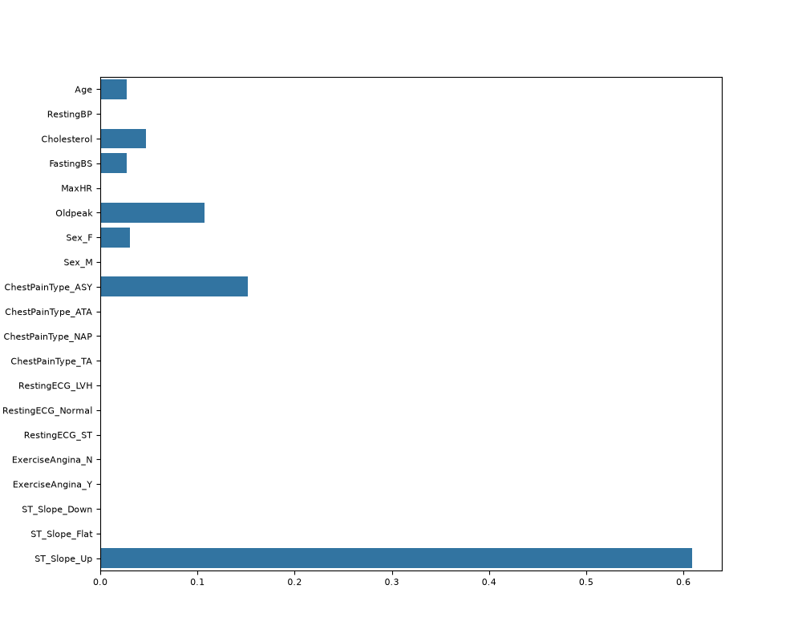
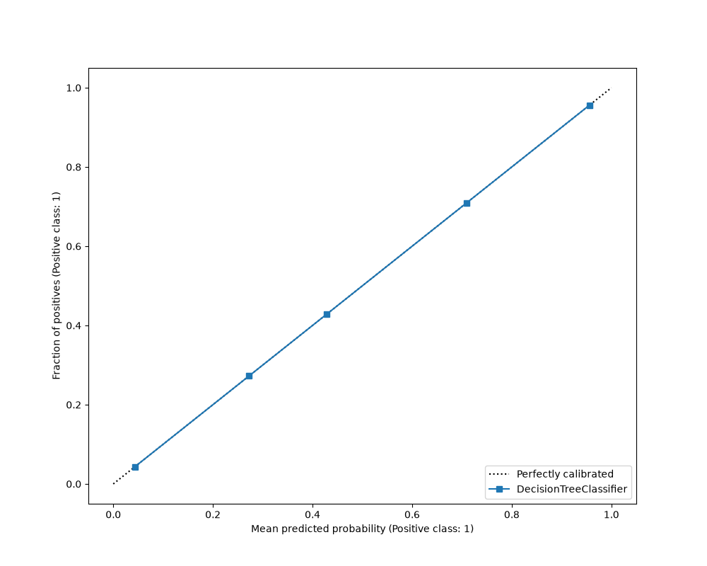
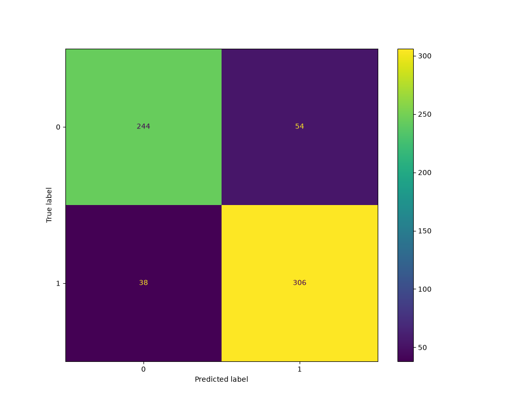
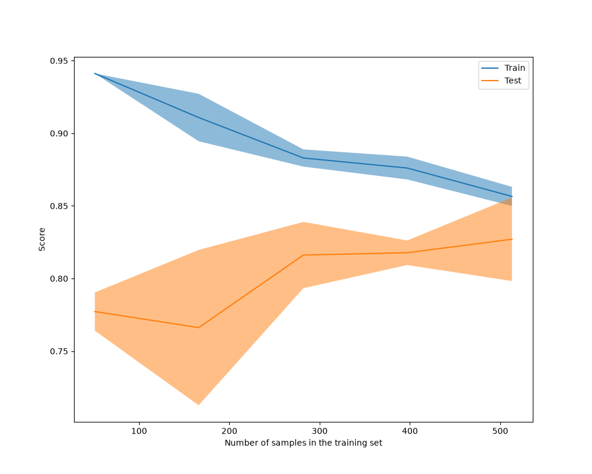
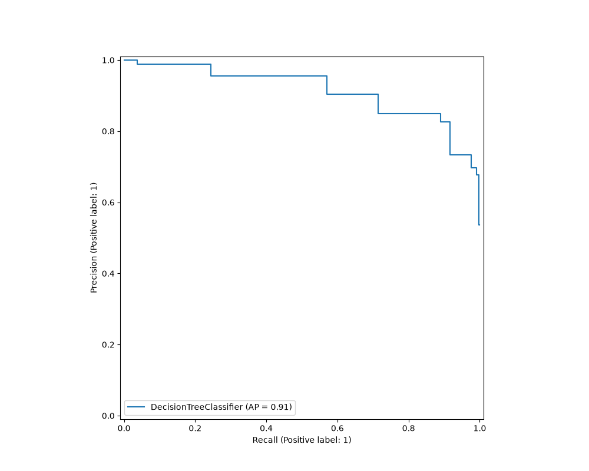
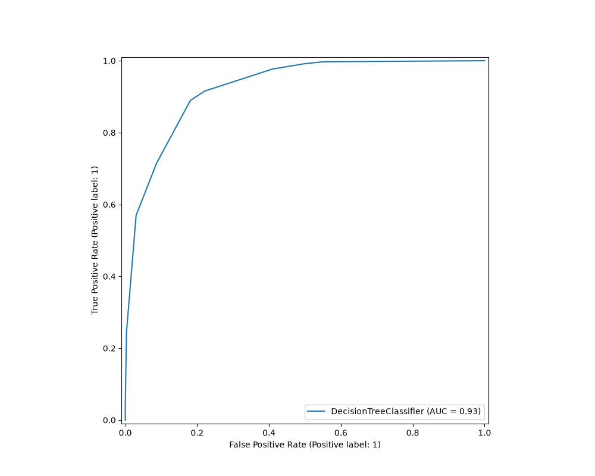
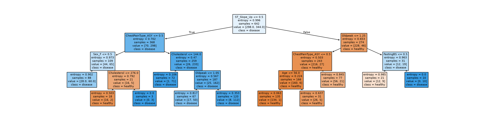
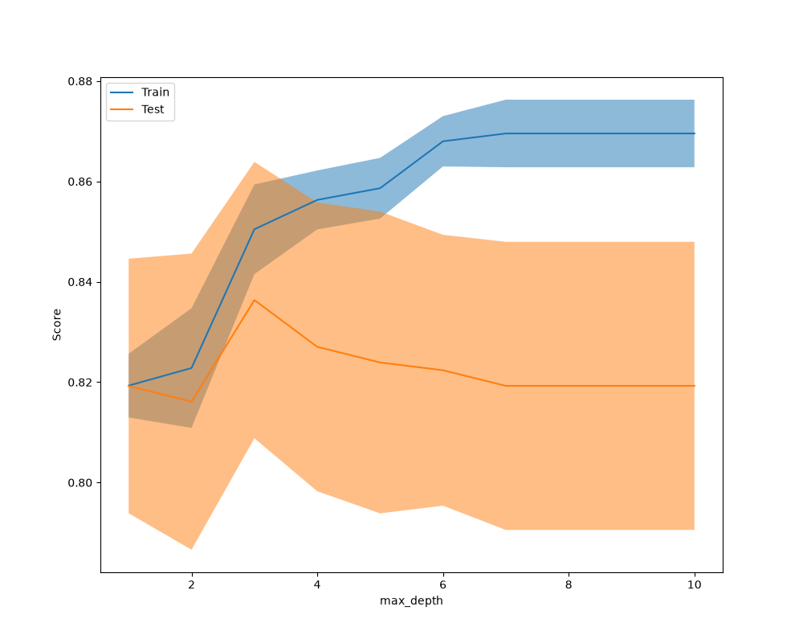

# Decision Tree Classifier

A decision tree classifier for heart-failure prediction on the Kaggle heart-failure dataset.

## Overview
- Splits data by yes/no rules into branches; each leaf = a class
- Interpretable rules, non-linear splits, fast baseline
- Per-individual probabilities (leaf-level & fixed value), overfits if deep

## Dataset
- Heart-failure dataset from Kaggle (fedesoriano/heart-failure-prediction), downloaded via kagglehub

## Project structure
- trees/decision_t.py - model functions
- trees/run.py - runs the pipeline
- trees/__init__.py - marks trees as a package
- trees/plots/ - generated evaluation plots
- pyproject.toml - dependencies and config

## Usage
Run from the project root:

    python trees/run.py

## Installation
Clone the repository:

    git clone https://github.com/aspark003/decision_trees_classifier.git

Install dependencies:

    pip install -e .

## Outcome
- The model reaches 85.67% accuracy and 92.58 ROC-AUC, with cross-validation at 82.70%
- A ~9-point gap between train and cross-val shows mild overfitting
- Predictions are driven mostly by ST_Slope_Up, ChestPainType_ASY, and Oldpeak
- Shallow depth (3-4) generalizes best; more training data narrows the train/test gap

## Results
| Metric | Score |
|---|---|
| Accuracy | 85.67 |
| Cross-val score | 82.70 |
| ROC-AUC | 92.58 |
| Average precision | 91.48 |
| Overfit | 9.19 |

## Classification report
Per-class precision, recall, and f1-score (training data):

| Class | Precision | Recall | F1-score | Support |
|---|---|---|---|---|
| 0 (healthy) | 0.87 | 0.82 | 0.84 | 298 |
| 1 (disease) | 0.85 | 0.89 | 0.87 | 344 |
| Accuracy | | | 0.86 | 642 |
| Macro avg | 0.86 | 0.85 | 0.86 | 642 |
| Weighted avg | 0.86 | 0.86 | 0.86 | 642 |

## Feature importance
| Feature | Importance (%) |
|---|---|
| ST_Slope_Up | 60.91 |
| ChestPainType_ASY | 15.17 |
| Oldpeak | 10.74 |
| Cholesterol | 4.71 |
| Sex_F | 3.02 |
| FastingBS | 2.76 |
| Age | 2.70 |

- Remaining features had 0% importance (pruned by the tree)

## Model details
- DecisionTreeClassifier with:
    - criterion='entropy'
    - max_depth=4
    - min_impurity_decrease=0.01
    - min_samples_leaf=3
    - random_state=42
- Train/test split: 70/30 (test_size=0.3)

## Validation summary
Train/test scores by max_depth (top 5 by test score):

| max_depth | Train | Test |
|---|---|---|
| 3 | 0.85 | 0.84 |
| 4 | 0.86 | 0.83 |
| 5 | 0.86 | 0.82 |
| 6 | 0.87 | 0.82 |
| 7 | 0.87 | 0.82 |

- Deeper trees improve train score but not test - shallow depth generalizes best.

## Learning curve
Mean train/test scores by training-set size:

| Train size | Train | Test |
|---|---|---|
| 51  | 0.94 | 0.78 |
| 153 | 0.91 | 0.78 |
| 307 | 0.88 | 0.81 |
| 410 | 0.88 | 0.82 |
| 513 | 0.86 | 0.83 |

- Train and test scores converge as data grows - more data reduces overfitting

## Plots
Evaluation plots generated on each run

**Feature importance** - which features drive the model's splits

**Calibration** - how well predicted probabilities match actual outcomes

**Confusion matrix** - correct vs incorrect predictions per class

**Learning curve** - train/test performance as training data grows

**Precision-recall** - trade-off between precision and recall

**ROC curve** - true positive vs false positive trade-off

**Decision tree** - the trained tree's split structure

**Validation curve** - performance across max_depth values

## Requirements
- Python 3.13
- pandas
- scikit-learn
- matplotlib
- seaborn
- kagglehub

## License
MIT License - free to use, modify, and distribute.

## Author
Antonio Park
- GitHub: [aspark003](https://github.com/aspark003)
- LinkedIn: [antonio-p](https://linkedin.com/in/antonio-p-a504b2295)